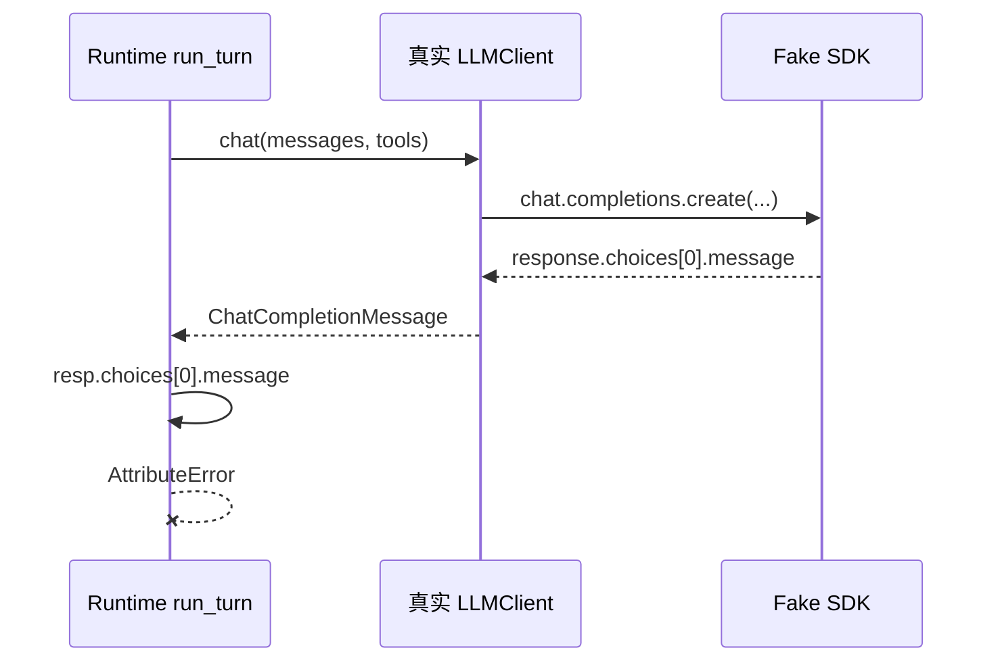
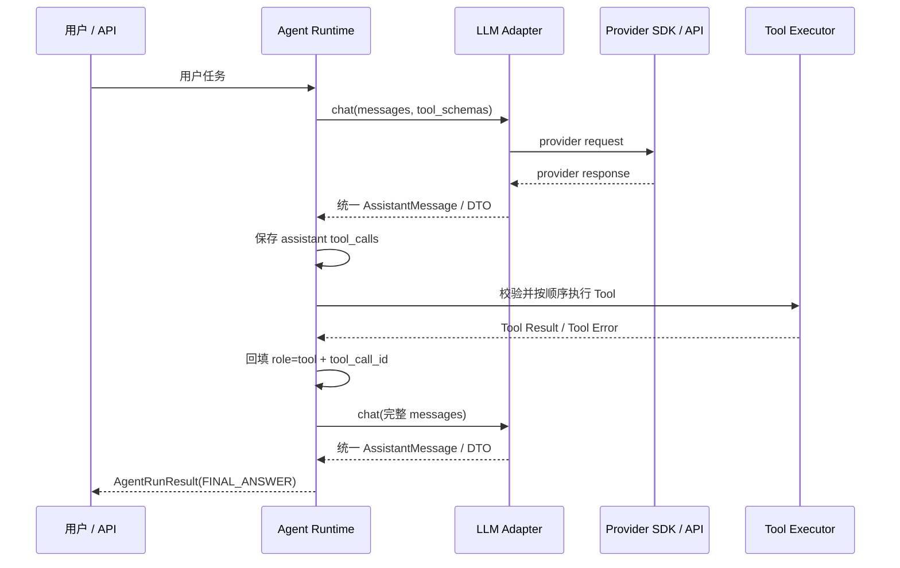
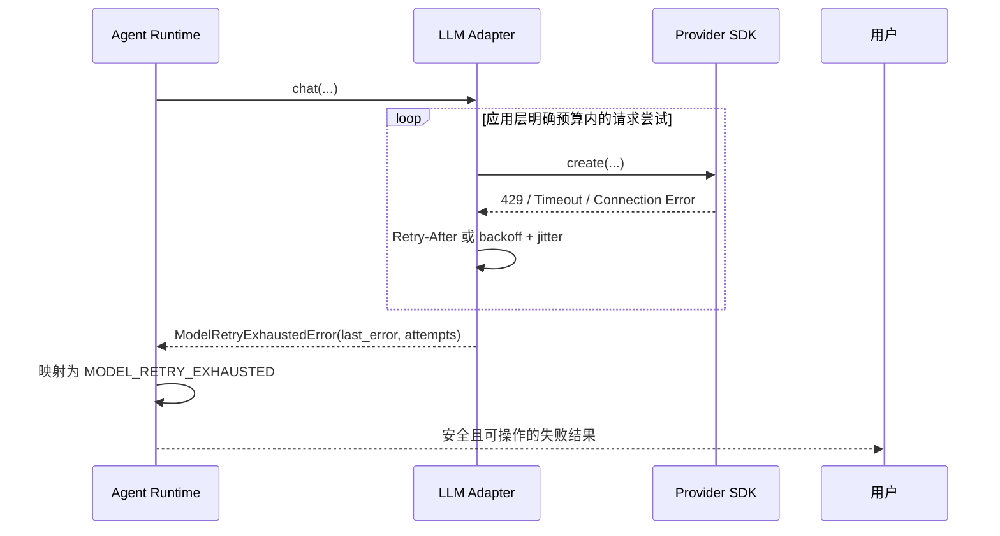

# S0 Runtime 证据：跨组件契约、工具回填与终态

> **职责：S0 的调用图与口述证据。** 说明当前代码的真实调用/错误流和分层边界；不替代完整 Trace、Checkpoint、线上指标或安全沙箱。
>
> 审计版本：HEAD `7159378`；复核日期：2026-09-13。
>
> `uv run pytest -q`：27 passed，但均未覆盖“真实 `LLMClient` + 真实 Runtime”的组合，因此只是组件级证据。

## 1. 当前已确认的跨组件断点

`LLMClient.chat()` 已把 SDK response 解包并返回 `ChatCompletionMessage`；`run_turn()` 却把该返回值再次当成 response wrapper，访问 `resp.choices[0].message`。一次无网络的 Fake SDK 组合探针会在 `agent/runtime/v0.py:140` 触发：

```text
AttributeError: 'ChatCompletionMessage' object has no attribute 'choices'
```



为什么 27 项测试仍然全绿：

- `tests/agent/test_llm_client.py` 验证 Client 返回 message。
- `tests/agent/test_runtime_v0.py` 的 Runtime Fake 返回带 `.choices` 的 response wrapper。
- 两组测试各自通过，却模拟了两个不同契约；缺少穿过两个真实组件边界的契约/集成测试。

当前状态必须写成 `TESTED(component) / INTEGRATION_FAILED`，不能写 `INTEGRATED`。修复顺序是：先补红色集成测试，再确定唯一返回 DTO/Protocol，最后最小改动实现。

## 2. 目标 Tool Calling 调用图（修复后）

下图是目标责任边界，不是当前已经打通的证据。



关键协议：模型只提出调用意图，Runtime 执行工具；`role="tool"` 和 `tool_call_id` 把 Observation 与具体调用配对。Runtime 只依赖项目自己的稳定消息契约，不应读取 Provider SDK 的 response wrapper。

## 3. 请求重试与任务终止



当前分层意图：

- LLM 适配层识别暂时性 Provider 失败，并转换成稳定错误契约。
- Runtime 决定任务怎样停止，生成 `StopReason` 和入口层可用结果。
- Runtime 不重放整个 Agent 回合；未来若工具产生副作用，整轮重放可能重复执行。

尚未关闭的风险：OpenAI SDK 自身可能有默认重试，应用层又实现重试。若不显式配置或计算，两层尝试会相乘。S0-02B 必须确定唯一重试责任，或把 SDK 重试次数、应用重试次数和最坏请求总数写成可测试预算。

## 4. 当前终态的证据边界

| StopReason | Runtime 组件测试中的触发条件 | 当前证据限制 |
|---|---|---|
| `FINAL_ANSWER` | Fake 模型没有 `tool_calls` | 真实 Client 组合尚未通过 |
| `MODEL_RETRY_EXHAUSTED` | Fake 抛出稳定的耗尽异常 | Client 与 Runtime 的返回契约仍失配 |
| `MAX_STEPS_EXCEEDED` | 达到固定 `MAX_STEPS=10` | 只限制模型回合，不限制时间、Token、成本或工具次数 |

## 5. 90 秒口述草稿（当前真实版本）

> 我把模型适配和 Agent Runtime 分成两层：适配层负责 Provider 请求、返回归一化和暂时性错误，Runtime 负责消息状态、Tool Call、终止原因和用户可见结果。组件测试覆盖了 429、超时、断连、坏工具参数和最大步数，但一次跨组件审计发现，Client 已返回 message，Runtime 仍按 SDK response 去访问 `.choices`，所以 27 项测试全绿并不等于集成成功。
>
> 根因不是模型不稳定，而是两个 Fake 模拟了不同接口，缺少真实组件组合测试。我会先写一个 Fake SDK 加真实 Client、真实 Runtime 的失败测试，再选定项目内部唯一的 AssistantMessage/DTO，让 Runtime 不依赖 Provider SDK 结构。与此同时，我会核对 SDK 默认重试，防止和应用重试相乘。
>
> 这个案例让我能区分单元测试、契约测试和集成测试，也能说明异常、重试和任务终止分别属于哪层。在回归真正通过之前，我只会把它写成组件已测试、集成失败，不会包装成已经可用。

## 6. 两层追问

1. **为什么不能直接让 Runtime 兼容 message 和 response 两种形状？**
   - 这会把 Provider 差异泄漏到核心运行时，扩大分支和测试矩阵。更稳妥的边界是 Adapter 归一化一次，Runtime 只消费一个内部契约。

2. **为什么 27 项测试没有提前发现？**
   - Client 测试和 Runtime 测试各自验证了内部逻辑，但 Runtime Fake 没有实现真实 Client 的返回形状。需要一条穿过真实边界的契约测试，并让 Fake 明确实现同一个 Protocol/DTO。

3. **为什么不重试整个 Agent 回合？**
   - 如果前面已经执行了写操作，整轮重放可能重复副作用。模型请求重试、Tool 重试和任务恢复必须分层，并用幂等键或 Checkpoint 约束副作用。
